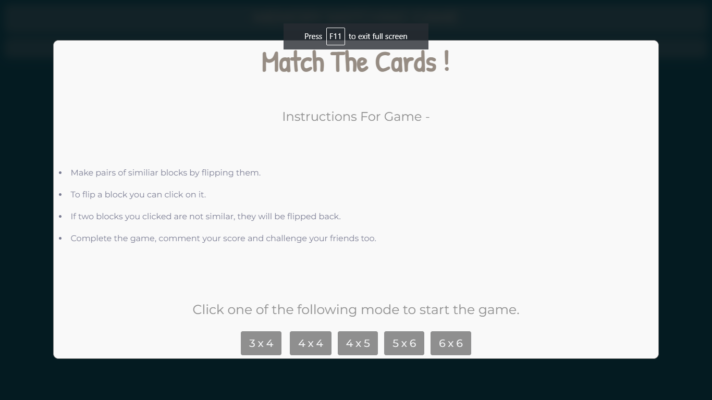
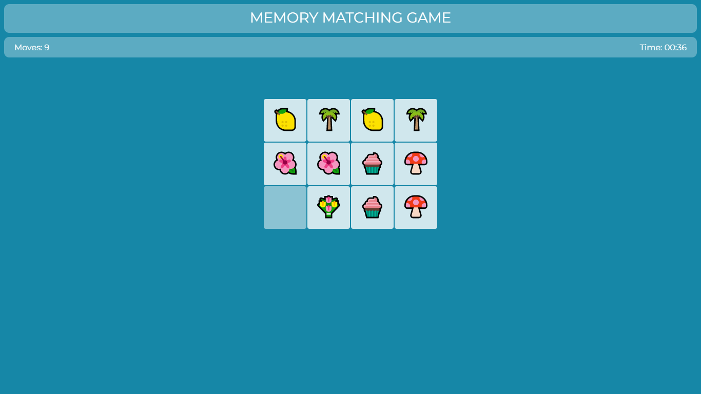
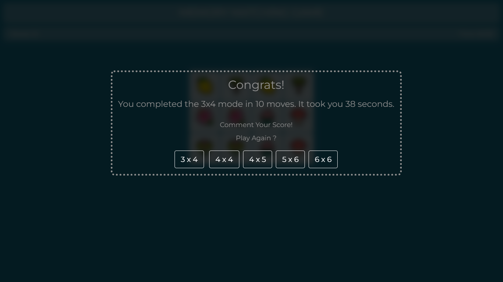

# WebDevelopment_Project-Memory_Game

A Simple Online memory matching game made using HTML,CSS &amp; JavaScript

## <b> [Click here to Play the GAME!!](https://github.com/nagavikram-joga/WebDev_Project-MemoryGame/blob/main/index.html)

 
Here are some snapshots from game.

  

